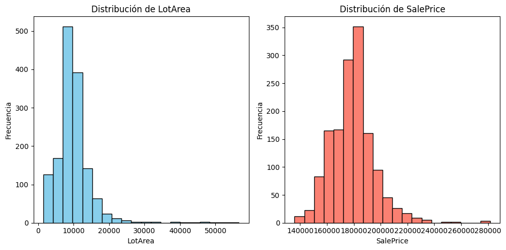
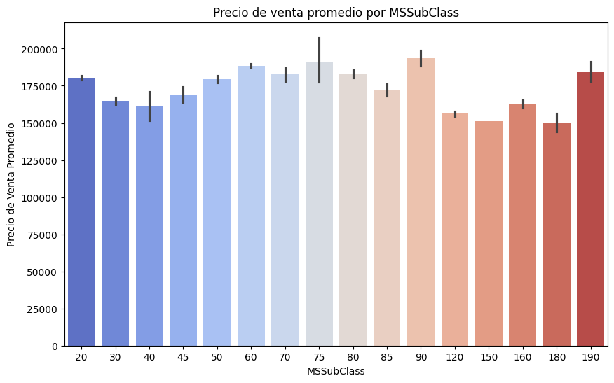

The housing market is a complex ecosystem influenced by a myriad of factors ranging from property characteristics to community development initiatives. In this article, we delve into the realm of exploratory analysis to uncover hidden insights within housing datasets. By employing various visualization techniques, we aim to shed light on the intricate dynamics of the real estate market, guiding stakeholders in making informed decisions

## Exploratory Analysis Approach:

Our exploratory analysis encompasses four key visualizations, each tailored to unveil specific aspects of the housing market:

### 1. Distribution of Housing Prices and Square Footage:

Histogram analysis of LotArea and SalePrice unveils insights into the distribution of land sizes and property prices within the dataset. By visualizing frequency distributions, trends, outliers, and market dynamics emerge, aiding in market segmentation, price elasticity analysis, and identification of market trends. This analysis enriches strategic decision-making by providing valuable insights into buyer preferences, pricing strategies, and investment opportunities.

### 2. Correlation between Housing Prices and Property Characteristics:

Scatter plots serve as a powerful tool in understanding the relationship between batch size and sale price. By plotting these variables against each other, we can discern any discernible patterns or correlations. Such insights are invaluable for stakeholders involved in pricing strategies and production decisions, offering a glimpse into the interplay between supply dynamics and market demand.

### 3. Time Series Analysis of Housing Prices:

Comparing sale price distributions across different housing types unveils variations in central tendency, spread, and the presence of outliers. Box plots provide a comprehensive snapshot of these distributions, aiding in the identification of market trends and pricing disparities. This analysis assists real estate professionals in gauging the competitive landscape and formulating targeted marketing strategies.

### 4. Comparative Analysis:
Statistical mean comparison tests or visual representations such as bar charts enable a direct comparison of average sale prices across housing classes or zoning areas. By elucidating these disparities, stakeholders gain valuable insights into market segmentation and investment opportunities. Such comparative analyses empower decision-makers to allocate resources effectively and capitalize on emerging trends.

### 5. Time Series Analysis:

Examining sale price trends over time offers a glimpse into the evolving dynamics of the housing market. Time series analysis techniques such as line charts or moving averages highlight trends, seasonal patterns, and fluctuations in market conditions. This longitudinal perspective equips stakeholders with the foresight needed to navigate market volatility, guiding investment strategies and mitigating risks.

## Conclusion:

In conclusion, exploratory analysis serves as a cornerstone in unraveling the complexities of the housing market. By leveraging visualization techniques, stakeholders gain a deeper understanding of market dynamics, enabling informed decision-making and strategic planning. As we continue to delve into the realm of data-driven insights, the potential for innovation and growth within the real estate sector remains boundless.