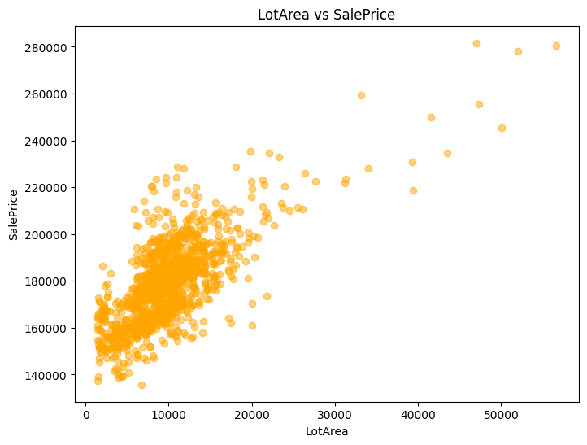
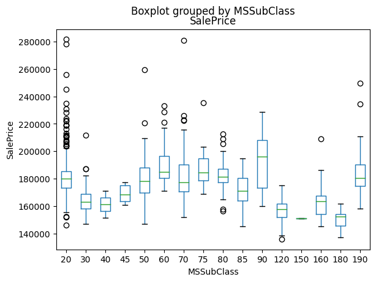
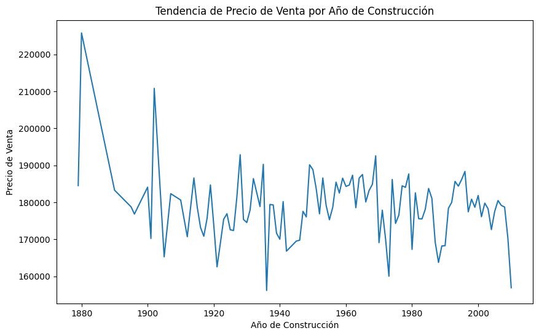

The housing market is a complex ecosystem influenced by a myriad of factors ranging from property characteristics to community development initiatives. In this article, we delve into the realm of exploratory analysis to uncover hidden insights within housing datasets. By employing various visualization techniques, we aim to shed light on the intricate dynamics of the real estate market, guiding stakeholders in making informed decisions

## Exploratory Analysis Approach:

Our exploratory analysis encompasses four key visualizations, each tailored to unveil specific aspects of the housing market:

### 1. Distribution of Housing Prices and Square Footage:

Analyzing the histograms of LotArea (the size of the land) and SalePrice (the price of properties) helps us understand how land sizes and property prices are spread out in the dataset. When we look at these histograms, we can see how often different land sizes and prices occur, notice any patterns or unusual values, and understand what's happening in the real estate market. This information can be really useful for figuring out different groups of buyers, how sensitive prices are to changes, and spotting trends in the market. Overall, this analysis helps us make smarter decisions about things like setting prices, understanding what buyers want, and finding good investment opportunities.

### 2. Correlation between Housing Prices and Property Characteristics:

Scatter plots are really helpful for seeing how batch size relates to sale price. When we plot these two things together, we can see if there's any clear linear connection between them. This helps people making decisions about pricing and production understand how supply and demand are affecting each other. It's like getting a sneak peek into how changes in production might impact sales and prices.

### 3. Time Series Analysis of Housing Prices:

When we compare how sale prices are spread out among different types of houses, we can see differences in the typical prices, how much they vary, and if there are any really expensive or cheap outliers. Box plots are great for giving us a quick overview of all this information. They help real estate folks understand what's happening in the market, like if certain types of houses are selling for more or less than others. This helps them figure out how to market properties effectively and stay competitive.

### 4. Comparative Analysis:
Comparing average sale prices across different types of houses or areas using statistical tests or visual tools like bar charts lets us see how they stack up against each other. By highlighting these differences, people involved can understand how the market is divided and where there might be good opportunities for investment. This kind of analysis helps decision-makers figure out where to focus their efforts and take advantage of new trends effectively.

### 5. Time Series Analysis:

Looking at how sale prices change over time gives us insight into how the housing market is changing. Techniques like using line charts or moving averages help us see patterns over time, like if prices go up or down in certain seasons or if there are big fluctuations in the market. This long-term view helps people involved in real estate make smart decisions about where to invest and how to handle risks, because they can see where the market might be headed.

## Conclusion:

In conclusion, exploratory analysis serves as a cornerstone in unraveling the complexities of the housing market. By leveraging visualization techniques, stakeholders gain a deeper understanding of market dynamics, enabling informed decision-making and strategic planning. As we continue to delve into the realm of data-driven insights, the potential for innovation and growth within the real estate sector remains boundless.

