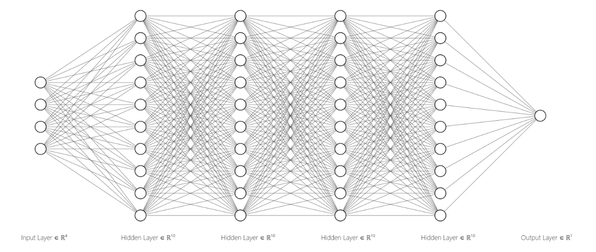
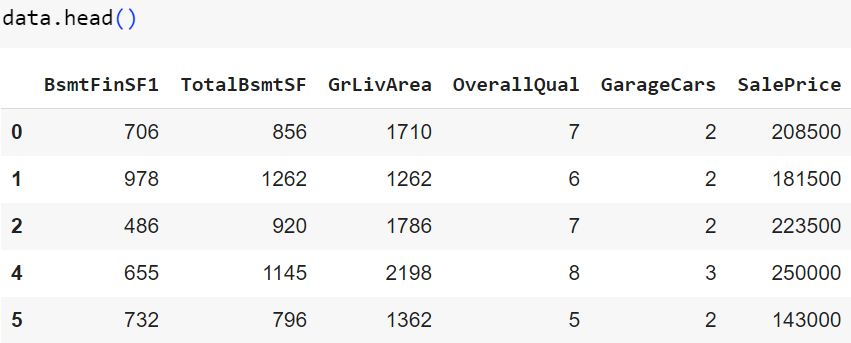
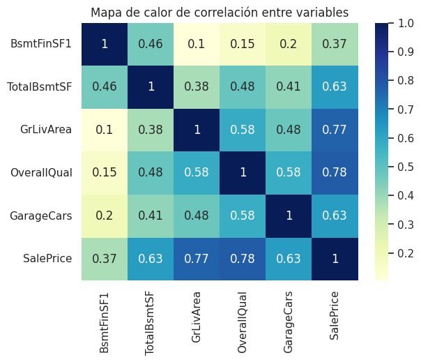
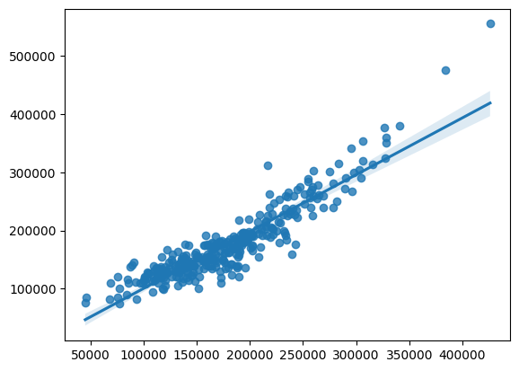

<style>
        h2 { 
          font-size: 1.5em;  
          font-weight: bold;
          margin-bottom: 1em;
        }


        h3 {
          font-size: 1.2em;
          font-weight: bold;
          margin-bottom: 1em;
        }

        p {
          margin-bottom: 1em;
        }

        li {
          margin-bottom: 1em;
        }

        img {
          margin: 4em auto;
        }
</style>

At the forefront of artificial intelligence, neural networks are constantly redefining what's achievable. Today, we introduce a neural network architecture specifically designed to tackle the complex challenge of predicting house sale prices.  Traditionally, house price prediction relies on statistical models that struggle to capture the intricate relationships between numerous factors influencing market value.

<div>
  <p>We define a list named inputs containing the following features:</p>
  <ul  class="list-disc list-inside">
    <li><b>TotalBsmtSF:</b> Total square footage of the basement area.</li>
    <li><b>GrLivArea:</b>  Above-ground living area square footage.</li>
    <li><b>OverallQual:</b> Overall quality grade (categorical variable).</li>
    <li><b>GarageCars:</b> Number of cars the garage can hold (categorical or numerical depending on how it's encoded).</li>
  </ul>
</div>

These features are chosen because they likely have a significant influence on a house's price. For example, larger living area and higher overall quality likely correspond to higher prices.

Also, we define a list named output containing a single element: SalePrice. This represents the target variable the MLP model is trying to predict - the selling price of the house.


Multi-Layer Perceptron (MLP) regressor is chosen for this task. MLPs are a type of artificial neural network well-suited for regression problems like predicting real estate prices.



## Hyperparameters:

<div>
  <p>We define the following hyperparameters for the MLP model:</p>
  <ul  class="list-disc list-inside">
    <li><b>Hidden layers:</b> Four hidden layers, each containing 10 nodes.</li>
    <li><b>Activation function:</b>  ReLU (Rectified Linear Unit) activation function.</li>
    <li><b>Regularization:</b> Alpha value of 0.05 (L1 regularization parameter).</li>
    <li><b>Training:</b> Maximum of 600 iterations.</li>
  </ul>
</div>

## Let's take a look at the code!!!

```python
  scores_ = []
  for k in range(100):
    #Separar los datos en entrenamiento y validación (testing)
    Train, Test = train_test_split(data, test_size=0.3, random_state = k+1)
    mlp_ = MLPRegressor(hidden_layer_sizes=(10,10,10,10), activation='relu', alpha = 0.05, max_iter=600)
    mlp_.fit(Train[inputs], Train[output])
    scores_.append(mlp_.score(Test[inputs],Test[output]))
```


## Objectives for estimation:

Using the provided data the main objective of using a linear regression model in this context is to accurately predict the sale prices of real estate properties using the data provided in the dataset. This can assist real estate agents, investors, and buyers in having a reasonable estimate of a property's value based on its characteristics. Additionally, by better understanding the relationships between a property's features and its  **Sale Price**, we can gain valuable insights into which features are most influential in the  **Sale Price** and how to enhance a property's value.
The different variables of the dataset were primarily analyzed, and several filters were applied to prepare the data before constructing a linear regression model. These filters included selecting only those properties with a normal sales condition, excluding sales between relatives that could be considered atypical. Additionally, the data were restricted to properties with all public utilities and no pool. Priority was also given to including properties with central air conditioning and those sold conventionally (WD). These filters were applied with the aim of improving the quality and relevance of the data, ensuring that the linear regression model captured significant and general relationships between the predictor variables and the response variable, which is the  **Sale Price** of the real estate properties.

### About our initial model selection

A linear regression model has been selected as a starting point due to its simplicity and ease of interpretation. Since the goal is to predict  **Sale Prices**, a linear regression model provides a straightforward way to model the relationship between a property's features and its  **Sale Price**. Additionally, linear regression is easily interpretable, which means we can clearly understand how each feature contributes to the prediction of the **Sale Price**. When it's suspected that the relationship between the predictor variables and the response variable is approximately linear, the linear regression model is a natural choice. Although real relationships may not be strictly linear, the linear regression model can provide a good approximation in many cases.

### Our linear regression model


We select these variables to estimate the sale price because they represent key features of a property that are widely recognized to influence its value in the real estate market. 

1. **BsmtFinSF1:** type 1 finished square feet

2. **TotalBsmtSF:** total square feet of basement area

3. **GrLivArea:** above grade (ground) living area square feet

4. **OverallQual:** Rates the overall material and finish of the house

5. **GarageCars:** size of garage in car capacity




By including these variables in our regression model, we aim to capture the influence of these fundamental property characteristics on the sale price. This selection is based on common knowledge and empirical evidence in the real estate industry, suggesting that these factors are significant predictors of housing prices.

**Correlation heatmap:**

The correlation heatmap, as evidenced earlier, is useful for identifying which variables are most correlated with the response variable. Additionally, by understanding the relationship between predictor variables and the response variable, it becomes possible to validate whether the linear regression model is suitable for the given dataset; if predictor variables have low correlation with the response variable, it may indicate that a linear regression model may not be the best option and that another modeling approach might be more appropriate.

In the case of BsmtFinSF1, there is a moderate positive correlation with the response variable SalePrice. However, this correlation suggests that when one variable increases, the other tends to increase, although not very strongly. This indicates that upon conducting a more detailed analysis, we might find that this variable may not have such a significant influence on the response variable.



### Validation methods and employed metrics information

**Validation Method:**
- **·** The dataset is split into two subsets, one for training the model and the other for validation/testing. 
- **·** 70% of the data is used for training (`train_size=0.7`), and the remaining 30% is used for testing.
- **·** Random state is set to 15 (`random_state=15`) to ensure reproducibility.

**Metrics Employed:**
- The `score()` method from the `LinearRegression` model is used to calculate the coefficient of determination (R^2 score) on the test data. This score indicates the proportion of the variance in the dependent variable (SalePrice) that is predictable from the independent variables (inputs).

**Visualization:**
- A scatter plot with a regression line is generated to visually compare the predicted SalePrice (`y_pred`) against the actual SalePrice (`y_real`). This provides a visual assessment of how well the model predictions align with the actual values.

By utilizing a train-test split approach and evaluating the model's performance using the coefficient of determination (R^2 score), this code snippet demonstrates a basic validation method and metric employed for assessing the performance of the linear regression model. Additionally, the visualization aids in understanding the model's predictive capability by comparing predicted and actual SalePrice values.

### Preliminary conclusions derived from current analysis

Based on the obtained R^2 score of 0.8418, our preliminary analysis suggests that the linear regression model provides a robust framework for predicting property sale prices using the selected input features. This high coefficient of determination indicates that approximately 84.18% of the variability in sale prices can be explained by the included predictors, namely BsmtFinSF1, TotalBsmtSF, GrLivArea, OverallQual, and GarageCars. Such a strong performance underscores the significance of these features in determining property values. However, while the model demonstrates promising predictive capability, further examination is warranted to explore potential refinements and enhancements. This could involve assessing additional variables, exploring alternative modeling techniques, or conducting diagnostic assessments to ensure the model's assumptions hold. Overall, our preliminary findings suggest that the linear regression model is a valuable tool for understanding and predicting property sale prices, providing a foundation for further analysis and refinement.


<div class="flex justify-center mt-10">
<a href="https://colab.research.google.com/drive/11M6GkYTUHQzPCFlJZEBNw1sCiE7yZdZ6?usp=sharing" class="inline-flex items-center px-5 py-2.5 text-sm font-medium text-center text-white bg-blue-700 rounded-lg hover:bg-blue-800 focus:ring-4 focus:outline-none focus:ring-blue-300 dark:bg-blue-600 dark:hover:bg-blue-700 dark:focus:ring-blue-800">
            Google Colab
  <svg class="w-3.5 h-3.5 ms-2 rtl:rotate-180" aria-hidden="true" xmlns="http://www.w3.org/2000/svg" fill="none" viewBox="0 0 14 10"><path stroke="currentColor" stroke-linecap="round" stroke-linejoin="round" stroke-width="2" d="M1 5h12m0 0L9 1m4 4L9 9"/>
</svg>
</a>
</div>
