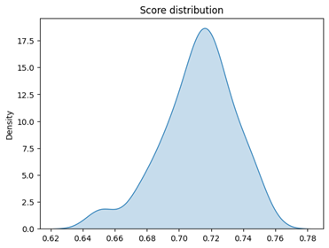
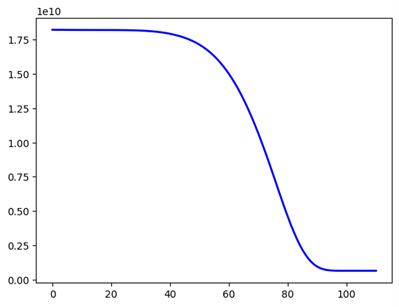
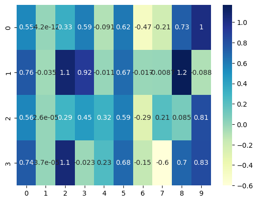
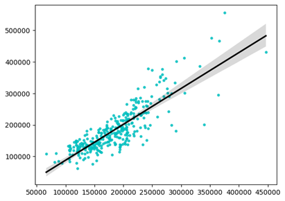
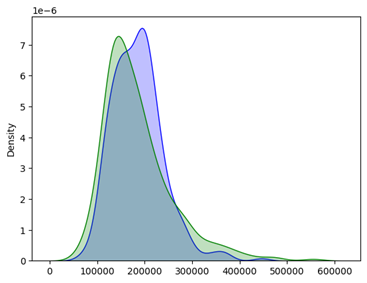

<style>
        h2 { 
          font-size: 1.5em;  
          font-weight: bold;
          margin-bottom: 1em;
        }


        h3 {
          font-size: 1.2em;
          font-weight: bold;
          margin-bottom: 1em;
          margin-top: 2em;
        }

        p {
          margin-bottom: 1em;
          margin-top: 1em;
        }

        ul {
          margin-bottom: 1em;
          margin-top: 1em;
        }

        ol {
          margin-bottom: 1em;
          margin-top: 1em;
        }

        li {
          margin-bottom: 1em;
          margin-top: 1em;
        }

        img {
          margin: 4em auto;
        }
</style>

At the forefront of artificial intelligence, neural networks are constantly redefining what's achievable. Today, we introduce a neural network architecture specifically designed to tackle the complex challenge of predicting house sale prices. Traditionally, house price prediction relies on statistical models that struggle to capture the intricate relationships between numerous factors influencing market value.

<div>
  <p>We define a list named inputs containing the following features:</p>
  <ul  class="list-disc list-inside">
    <li><b>TotalBsmtSF:</b> Total square feet of basement area.</li>
    <li><b>GrLivArea:</b>  Above grade (ground) living area square feet.</li>
    <li><b>OverallQual:</b> Rates the overall material and finish of the house.</li>
    <li><b>GarageCars:</b> Size of garage in car capacity.</li>
  </ul>
</div>

These features are chosen because they likely have a significant influence on a house's price. For example, larger living area and higher overall quality likely correspond to higher prices.

Also, we define a list named output containing a single element: SalePrice. This represents the target variable the MLP model is trying to predict - the selling price of the house.


Multi-Layer Perceptron (MLP) regressor is chosen for this task. MLPs are a type of artificial neural network well-suited for regression problems like predicting real estate prices.


### Hyperparameters:

<p>We define the following hyperparameters for the MLP model:</p>
<ul  class="list-disc list-inside">
  <li><b>Hidden layers:</b> Four hidden layers, each containing 10 nodes.</li>
  <li><b>Activation function:</b>  ReLU (Rectified Linear Unit) activation function.</li>
  <li><b>Regularization:</b> Alpha value of 0.05 (L1 regularization parameter).</li>
  <li><b>Training:</b> Maximum of 600 iterations.</li>
</ul>

## Let's take a look at the code!!!

```python
  scores_ = []
  for k in range(100):
    #Separar los datos en entrenamiento y validación (testing)
    Train, Test = train_test_split(data, test_size=0.3, random_state = k+1)
    mlp_ = MLPRegressor(hidden_layer_sizes=(10,10,10,10), activation='relu', alpha = 0.05, max_iter=600)
    mlp_.fit(Train[inputs], Train[output])
    scores_.append(mlp_.score(Test[inputs],Test[output]))
```

<p>This code performs a loop that trains and evaluates an MLP model 100 times.</p>

<ol class="list-decimal list-inside">
  <li><b>Initialization:</b>
    <ul  class="list-disc list-inside ml-4">
     <li>An empty list called <b>scores_</b> is created to store the evaluation scores of each model. </li>
    </ul>
  </li>
  <li><b>Data Splitting (K-Fold Simulation):</b>
    <ul  class="list-disc list-inside ml-4">
     <li>The loop iterates 100 times (represented by k).</li>
     <li>Inside the loop, the <b>train_test_split</b> function splits the entire data (<b>data</b>) into two sets: 
        <ul  class="list-disc list-inside ml-4">
          <li><b>Training set (Train):</b> This contains 70% of the data (default for <b>test_size=0.3</b>). This set is used to train the MLP model.</li>
          <li><b>Testing set (Test):</b> This contains the remaining 30% of the data. This set is used to evaluate how well the trained model performs on unseen data.</li>
        </ul>     
     </li>
     <li><b>random_state = k+1</b>  is used to shuffle the data differently in each iteration. This helps reduce the impact of the order in which data is presented to the model.</li>
    </ul>
  </li>
  <li><b>Model Creation and Training:</b>
    <ul  class="list-disc list-inside ml-4">
     <li>An MLP regressor model (<b>mlp_</b>) is created. The model (<b>mlp_</b>) is then trained using the training data (<b>Train[inputs], Train[output]</b>). </li>
    </ul>
  </li>
  <li><b>Model Evaluation:</b>
    <ul  class="list-disc list-inside ml-4">
     <li>After training, the model's performance is evaluated on the testing data (<b>Test[inputs], Test[output]</b>). The <b>mlp_.score</b> method used for evaluation might be employing a different metric, possibly the coefficient of determination (R-squared). R-squared ranges from 0 to 1, where a higher value (closer to 1) indicates a better fit between the predicted and actual selling prices.</li>
    </ul>
  </li>
  <li><b>Looping:</b>
    <ul  class="list-disc list-inside ml-4">
     <li>The loop iterates 99 more times, repeating steps 2-4 with different data splits due to the <b>random_state</b> variation.</li>
    </ul>
  </li>
  
</ol>

### Evaluation Metric:

<p>The 100 iterations are used to train 100 different MLP models with slightly different random weight initializations. This helps in:</p>
<ul  class="list-disc list-inside">
  <li><b>Reducing Overfitting: </b> By training multiple models with different starting points, the model is less likely to overfit to the specific training data and might generalize better to unseen data.</li>
  <li><b>Improving Generalizability:</b> Training with different weight initializations can explore different regions of the solution space, potentially leading to a more robust model.</li>
</ul>

### What the code must be doing:

<p>The code must be performing the following:</p>

<ol class="list-decimal list-inside ml-4">
  <li>Train 100 MLP models, each with the defined hyperparameters, but with different random weight initializations due to <b>random_state = k+1.</b></li>
  <li>For each model, evaluate its performance on the testing data using <b>mlp_.score</b> (which might be using R-squared or another metric).</li>
  <li>Store the evaluation scores (e.g., R-squared) in the <b>scores_ list.</b></li>
</ol>

### Later Analysis:

<p>After the loop completes, we might have 100 evaluation scores in <b>scores_.</b> You could then analyze these scores to:</p>
<ul  class="list-disc list-inside ml-4"">
  <li><b>Understand the model's variability:</b> See how much the performance varies across different model initializations.</li>
  <li><b>Select a "good" model:</b> Choose a model with a high evaluation score (e.g., R-squared) to represent your final model.</li>
</ul>

## let's take a look at the results!



The distribution is characterized by a unimodal shape, which means that there is a single peak that represents the most probable score. The peak is located around 0.72, which indicates that this is the most common score.

The distribution also shows some asymmetry, with a longer tail to the right than to the left. This indicates that there is a higher probability that the scores will be high than low.

<b>Loss Function</b>



<p>The loss function of a neural network is a measure of the error that the network makes when performing a specific task. A low loss function indicates that the network is making minimal error, while a high loss function indicates that the network is making significant error.

The decreasing trend of the neural network's loss function reflects the network's learning and improvement in performance. This means that the network is making fewer and fewer errors as it is trained.</p>

## Lets take a look into the neuronal network model!!



<p>The heatmap represents the strength of each connection between the inputs and the first hidden layer, with warmer colors indicating stronger connections and cooler colors indicating weaker connections.</p>

## Predicted values vs. actual values



<p>The spread of the points around the line indicates the amount of error in the model's predictions. In this case, the points on the plot are scattered around the line, but they are generally clustered closer to the line than they are to the edges of the plot. This suggests that the model is making reasonably good predictions, but there is still some room for improvement.</p>



<ul  class="list-disc list-inside">
  <li><b>Blue:</b> Predicted values.</li>
  <li><b>Green:</b> Real values.</li>
</ul>

Our neural network model achieved an average score of 71%. Compared to the linear regression model that had a score of 84%, the latter clearly had better performance.

## Possible explanations for why the neural network had a lower score:

<p><b>Overfitting:</b> It is possible that the neural network overfitted to the training data, which means that it learned to memorize the data rather than learning the underlying relationships between the variables. This can lead to poor performance on new data that was not seen during training.</p>

<p><b>Lack of data:</b> It is possible that the neural network did not have enough data to train properly. Neural networks need a large amount of data to learn the complex relationships between the variables. If there is not enough data, the neural network will not be able to learn these relationships and will therefore perform poorly.</p>

<p><b>Incorrect network architecture:</b> It is possible that the architecture of the neural network was not suitable for the problem. The architecture of a neural network is important for its performance. If the architecture is not correct, the neural network will not be able to learn the relationships between the variables and will therefore perform poorly.</p>


<div class="flex justify-center mt-10">
<a href="https://colab.research.google.com/drive/1AUigWU7IPCbbnkStYdwKUvLUoYH1Ib-f?usp=sharing" class="inline-flex items-center px-5 py-2.5 text-sm font-medium text-center text-white bg-blue-700 rounded-lg hover:bg-blue-800 focus:ring-4 focus:outline-none focus:ring-blue-300 dark:bg-blue-600 dark:hover:bg-blue-700 dark:focus:ring-blue-800">
            Google Colab
  <svg class="w-3.5 h-3.5 ms-2 rtl:rotate-180" aria-hidden="true" xmlns="http://www.w3.org/2000/svg" fill="none" viewBox="0 0 14 10"><path stroke="currentColor" stroke-linecap="round" stroke-linejoin="round" stroke-width="2" d="M1 5h12m0 0L9 1m4 4L9 9"/>
</svg>
</a>
</div>
