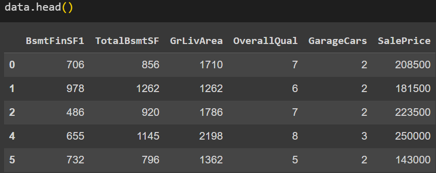

<style>
        h2 { 
          font-size: 1.5em;  
          font-weight: bold;
          margin-bottom: 1em;
        }


        h3 {
          font-size: 1.2em;
          font-weight: bold;
          margin-bottom: 1em;
        }

        p {
          margin-bottom: 1em;
        }

        li {
            margin-bottom: 1em;
        }

        img {
            margin: auto;
        }
</style>

- Model selection in machine learning is crucial for developing effective predictive systems. It involves exploring various algorithms, from linear regressions to more complex models like decision trees or neural networks, with the aim of striking a balance between model complexity and its ability to generalize patterns in the data. Exhaustive testing, cross-validation, and optimization techniques are used to select the model that produces the most accurate and reliable predictions for the sale price.

- ## Objectives for estimation:

- Using the provided data the main objective of using a linear regression model in this context is to accurately predict the sale prices of real estate properties using the data provided in the dataset. This can assist real estate agents, investors, and buyers in having a reasonable estimate of a property's value based on its characteristics. Additionally, by better understanding the relationships between a property's features and its  **Sale Price**, we can gain valuable insights into which features are most influential in the  **Sale Price** and how to enhance a property's value.
The different variables of the dataset were primarily analyzed, and several filters were applied to prepare the data before constructing a linear regression model. These filters included selecting only those properties with a normal sales condition, excluding sales between relatives that could be considered atypical. Additionally, the data were restricted to properties with all public utilities and no pool. Priority was also given to including properties with central air conditioning and those sold conventionally (WD). These filters were applied with the aim of improving the quality and relevance of the data, ensuring that the linear regression model captured significant and general relationships between the predictor variables and the response variable, which is the  **Sale Price** of the real estate properties.

### About our initial model selection

A linear regression model has been selected as a starting point due to its simplicity and ease of interpretation. Since the goal is to predict  **Sale Prices**, a linear regression model provides a straightforward way to model the relationship between a property's features and its  **Sale Price**. Additionally, linear regression is easily interpretable, which means we can clearly understand how each feature contributes to the prediction of the **Sale Price**. When it's suspected that the relationship between the predictor variables and the response variable is approximately linear, the linear regression model is a natural choice. Although real relationships may not be strictly linear, the linear regression model can provide a good approximation in many cases.

### **Our linear regression model**
```latex
\[
\text{SalePrice} = \theta_0 + \theta_1 \cdot \text{BsmtFinSF1} + \theta_2 \cdot \text{TotalBsmtSF} + \theta_3 \cdot \text{GrLivArea} + \theta_4 \cdot \text{OverallQual} + \theta_5 \cdot \text{GarageCars}
\]
```

We select these variables to estimate the sale price because they represent key features of a property that are widely recognized to influence its value in the real estate market. 

1. **BsmtFinSF1:** type 1 finished square feet

2. **TotalBsmtSF:** total square feet of basement area

3. **GrLivArea:** above grade (ground) living area square feet

4. **OverallQual:** Rates the overall material and finish of the house

5. **GarageCars:** size of garage in car capacity




By including these variables in our regression model, we aim to capture the influence of these fundamental property characteristics on the sale price. This selection is based on common knowledge and empirical evidence in the real estate industry, suggesting that these factors are significant predictors of housing prices.


### Validation methods and employed metrics information

**Validation Method:**
- Train-Test Split: The dataset is split into two subsets, one for training the model and the other for validation/testing. 
  - 70% of the data is used for training (`train_size=0.7`), and the remaining 30% is used for testing.
  - Random state is set to 15 (`random_state=15`) to ensure reproducibility.

**Metrics Employed:**
- Model Score: The `score()` method from the `LinearRegression` model is used to calculate the coefficient of determination (R^2 score) on the test data. This score indicates the proportion of the variance in the dependent variable (SalePrice) that is predictable from the independent variables (inputs).

**Visualization:**
- Comparison Plot: A scatter plot with a regression line is generated to visually compare the predicted SalePrice (`y_pred`) against the actual SalePrice (`y_real`). This provides a visual assessment of how well the model predictions align with the actual values.

By utilizing a train-test split approach and evaluating the model's performance using the coefficient of determination (R^2 score), this code snippet demonstrates a basic validation method and metric employed for assessing the performance of the linear regression model. Additionally, the visualization aids in understanding the model's predictive capability by comparing predicted and actual SalePrice values.

### Preliminary conclusions derived from current analysis

Based on the obtained R^2 score of 0.8418, our preliminary analysis suggests that the linear regression model provides a robust framework for predicting property sale prices using the selected input features. This high coefficient of determination indicates that approximately 84.18% of the variability in sale prices can be explained by the included predictors, namely BsmtFinSF1, TotalBsmtSF, GrLivArea, OverallQual, and GarageCars. Such a strong performance underscores the significance of these features in determining property values. However, while the model demonstrates promising predictive capability, further examination is warranted to explore potential refinements and enhancements. This could involve assessing additional variables, exploring alternative modeling techniques, or conducting diagnostic assessments to ensure the model's assumptions hold. Overall, our preliminary findings suggest that the linear regression model is a valuable tool for understanding and predicting property sale prices, providing a foundation for further analysis and refinement.

